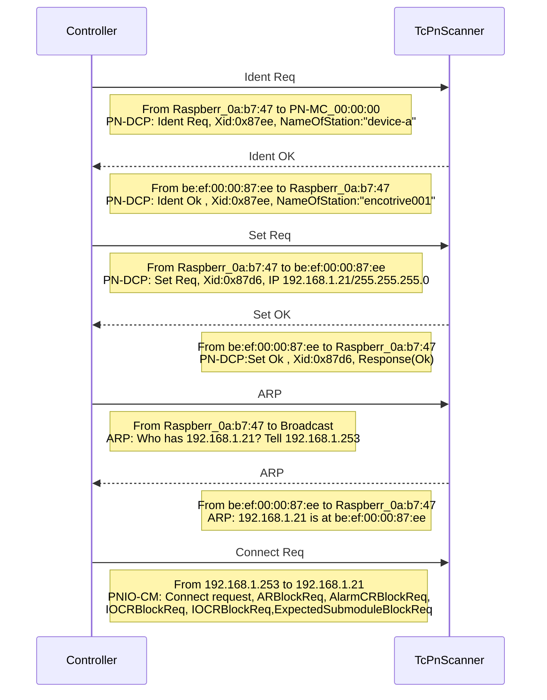

[](https://github.com/TcHaxx/TcPnScanner/actions/workflows/cicd.yml)
[](https://www.nuget.org/packages/dsian.TcPnScanner.CLI/)
# TcPnScanner
Scans a Profinet controller for requested devices and adds all stations (devices) to a Profinet IO Device (TF6270).

## Why?
This is useful for virtual commissioning/digital-twin (`HiL`) projects with `Beckhoff TwinCAT`.
It's always a huge pain to gather all required `GSDML` files and to add and configure the devices manually.

## How?

It captures the connected `Profinet Controller` (Master) with `SharpPcap` and parses the received packets.
The captured information's are then transformed into a `*.xti` file, which can be imported into `TwinCAT` via the [Add Existing Item…](https://infosys.beckhoff.com/english.php?content=../content/1033/tc3_io_intro/1084406539.html) dialog.
A typical handshake between the `Controller` and `TcPnScanner` looks like this:


## Install

Install via [dotnet tool install](https://learn.microsoft.com/en-us/dotnet/core/tools/dotnet-tool-install):
```sh
dotnet tool install dsian.TcPnScanner.CLI -g
```
outputs
```sh
You can invoke the tool using the following command: dsian.TcPnScanner.CLI
Tool 'dsian.tcpnscanner.cli' (version '0.1.0') was successfully installed.
```
## Update
```sh
dotnet tool update dsian.TcPnScanner.CLI -g
```

## Uninstall
```sh
dotnet tool uninstall dsian.TcPnScanner.CLI -g
```
outputs
```sh
Tool 'dsian.tcpnscanner.cli' (version '0.1.0') was successfully uninstalled.
```

## Usage
### Options
Option | Required | Description
--- | --- | ---
`-d`<br/>`--capture-device` | no | The name of the capture device to use.
`-t`<br/>`--timeout` | no | Capture timeout in seconds.
`-f`<br/>`--pcap-file`| no | Read from a `*.pcap` capture file.
`-o`<br/>`--out-xti-file`| no | Output directory to export the `TwinCAT` `*.xti` export file.
`-l`<br/>`--log-level`| no | Minimum LogEventLevel, i.e. `Verbose`, `Debug`, `Information`, `Warning`, `Error`, `Fatal`.
`--log-file`| no | Path to logfile, default `%TEMP%/dsian.TcPnScanner.CLI/dsian.TcPnScanner.CLI-yyyyMMddhhmm.log`
`--dump`| no | Dump captured packets to file.
`--dump-file`| no | Pcap dump file.
`-h`<br/>`--help`| no| Display help screen.
`--version`| no| Display version information.

#### Example `-d`/`--capture-device`
Specify the name of the capture-device to use.  
It will look in the `device-name` or `device-description` for a matching capture-device.

Example, following devices are available on the machine:
```
0) \Device\NPF_{00000000-1234-CDEF-A603-392E759CB82A} Bluetooth Device (Personal Area Network) #2
1) \Device\NPF_{00000001-5678-1234-BFB0-E2A6A36CE73D} Intel(R) Wi-Fi 6 AX201 160MHz
2) \Device\NPF_{00000002-90AB-5678-8E50-52A7B958DB2F} TwinCAT-Intel PCI Ethernet Adapter (Gigabit) V2
3) \Device\NPF_Loopback Adapter for loopback traffic capture
```
We want to capture with device `#2`:
```sh
dsian.TcPnScanner.CLI -d twincat
```
```sh
[13:09:17 INF] 🎤 Selected Capture Device '\Device\NPF_{00000002-90AB-5678-8E50-52A7B958DB2F}: TwinCAT-Intel PCI Ethernet Adapter (Gigabit) V2'
[13:09:17 INF] Opening capture device '\Device\NPF_{00000002-90AB-5678-8E50-52A7B958DB2F}'...
[13:09:17 INF] Listening on \Device\NPF_{00000002-90AB-5678-8E50-52A7B958DB2F}...
[13:09:18 INF] 0 At: 14/04/2023 11:09:18:80: MAC:B827EB0AB747 -> MAC:010ECF000000 TYP:Profinet LEN:60
[13:09:18 INF] 1 At: 14/04/2023 11:09:18:130: MAC:B827EB0AB747 -> MAC:010ECF000000 TYP:Profinet LEN:60
[13:09:19 INF] 2 At: 14/04/2023 11:09:19:250: MAC:B827EB0AB747 -> MAC:010ECF000000 TYP:Profinet LEN:60
```

You may also specify the `GUID` of the device:
```sh
dsian.TcPnScanner.CLI -d 00000002-90AB
```

#### Example `-f`/`--pcap-file`
A previously captured `pcap`-file can be loaded, instead of capturing live-data:
```sh
dsian.TcPnScanner.CLI -l Information -f samples/sample-capture.pcap -o samples/sample-controller.xti
```
This loads the file `samples/sample-capture.pcap`, and replays the recieved packets:
```sh
dsian.TcPnScanner.CLI -l Information -f samples/sample-capture.pcap -o samples/sample-controller.xti
[12:48:04 INF] Opening capture device 'samples/sample-capture.pcap'...
[12:48:04 INF] Listening on samples/sample-capture.pcap...
[12:48:04 INF] 0 At: 13/04/2023 19:37:03:464: MAC:B827EB0AB747 -> MAC:010ECF000000 TYP:Profinet LEN:60
[12:48:04 INF] 1 At: 01/01/1970 00:00:00:0: MAC:BEEF0000B51A -> MAC:B827EB0AB747 TYP:Profinet LEN:37
[12:48:04 WRN] Ignoring packet: [EthernetPacket: SourceHardwareAddress=be:ef:00:00:b5:1a, DestinationHardwareAddress=b8:27:eb:0a:b7:47, Type=Profinet]
[12:48:04 INF] 2 At: 13/04/2023 19:37:03:864: MAC:B827EB0AB747 -> MAC:BEEF0000B51A TYP:Profinet LEN:60
[12:48:04 INF] 3 At: 01/01/1970 00:00:00:0: MAC:BEEF0000B51A -> MAC:B827EB0AB747 TYP:Profinet LEN:34
[12:48:04 WRN] Ignoring packet: [EthernetPacket: SourceHardwareAddress=be:ef:00:00:b5:1a, DestinationHardwareAddress=b8:27:eb:0a:b7:47, Type=Profinet]
[12:48:04 INF] 4 At: 13/04/2023 19:37:04:744: MAC:B827EB0AB747 -> MAC:FFFFFFFFFFFF TYP:Arp LEN:42
[12:48:04 INF] 5 At: 01/01/1970 00:00:00:0: MAC:BEEF0000B51A -> MAC:B827EB0AB747 TYP:Arp LEN:42
[12:48:04 INF] 6 At: 13/04/2023 19:37:04:745: MAC:B827EB0AB747 -> MAC:BEEF00005D5D TYP:IPv4 LEN:418
[12:48:05 INF] ✨ Successfully scanned 1 device(s)!
[12:48:05 INF] 📝 Exported devices to D:\densogiaichned\TcPnScanner\samples\sample-controller.xti
```

#### Example `-l`/`--log-level`
The default `LogEventLevel` is `Information`, which prints only the received packets header:
```sh
dsian.TcPnScanner.CLI -l Information -f samples/sample-capture.pcap -o samples/sample-controller.xti
[12:48:04 INF] Opening capture device 'samples/sample-capture.pcap'...
[12:48:04 INF] Listening on samples/sample-capture.pcap...
[12:48:04 INF] 0 At: 13/04/2023 19:37:03:464: MAC:B827EB0AB747 -> MAC:010ECF000000 TYP:Profinet LEN:60
[12:48:04 INF] 1 At: 01/01/1970 00:00:00:0: MAC:BEEF0000B51A -> MAC:B827EB0AB747 TYP:Profinet LEN:37
```

The level `Verbose` also prints out the content of a packet as `Raw Hex Output`:  
```sh
dsian.TcPnScanner.CLI -l Verbose -f samples/sample-capture.pcap -o samples/sample-controller.xti
[12:54:00 INF] Opening capture device 'samples/sample-capture.pcap'...
[12:54:00 INF] Listening on samples/sample-capture.pcap...
[12:54:00 INF] 0 At: 13/04/2023 19:37:03:464: MAC:B827EB0AB747 -> MAC:010ECF000000 TYP:Profinet LEN:60
[12:54:00 DBG] 0 content:
Data:  ******* Raw Hex Output - length=60 bytes
Data: Segment:                   Bytes:                              Ascii:
Data: --------------------------------------------------------------------------
Data: 0000  01 0e cf 00 00 00 b8 27  eb 0a b7 47 88 92 fe fe   .......' ...G....
Data: 0010  05 00 00 00 b5 1a 00 01  00 0a 02 02 00 05 70 6e   ........ ......pn
Data: 0020  2d 69 6f 00 00 00 00 00  00 00 00 00 00 00 00 00   -io..... ........
Data: 0030  00 00 00 00 00 00 00 00  00 00 00 00               ........ ....

```

#### Example `-h`/`--help`
```sh
dsian.TcPnScanner.CLI 0.1.0
Copyright (c) 2023 densogiaichned

ERROR(S):
  Option 'h' is unknown.

  -d, --capture-device    (Default: ) The name of the capture device to use.

  -t, --timeout           (Default: 180) Capture timeout in seconds.

  -f, --pcap-file         (Default: ) Read from a pcap capture file.

  -o, --out-xti-file      (Default: %TEMP%/$APPNAME$/$CONTROLLER$.xti) Output directory to export the TwinCAT Export file.

  -l, --log-level         (Default: Information) Minimum LogEventLevel

  --log-file              (Default: %TEMP%/$APPNAME$/$APPNAME$-.log) Path to logfile

  --dump                  (Default: false) Dump captured packets to file.

  --dump-file             (Default: %TEMP%/$APPNAME$/$APPNAME$-yyyyMMddHHmmss.pcap) Pcap dump file.

  --help                  Display this help screen.

  --version               Display version information.
```

## Acknowledgments
This tool uses the following open source libraries:

* [SharpPcap](https://github.com/dotpcap/sharppcap) - A cross-platform packet capture framework for the .NET environment.
Packet.Net - A .NET library for working with network packets.
* [CommandLineParser](https://github.com/commandlineparser/commandline) - A command line parsing library for .NET applications.
* [Verify](https://github.com/VerifyTests/Verify) - A library used for snapshot testing.
* [Serilog](https://github.com/serilog/serilog) - A logging library for .NET applications.

Thanks to the developers of these libraries for their contributions to the open source community.
