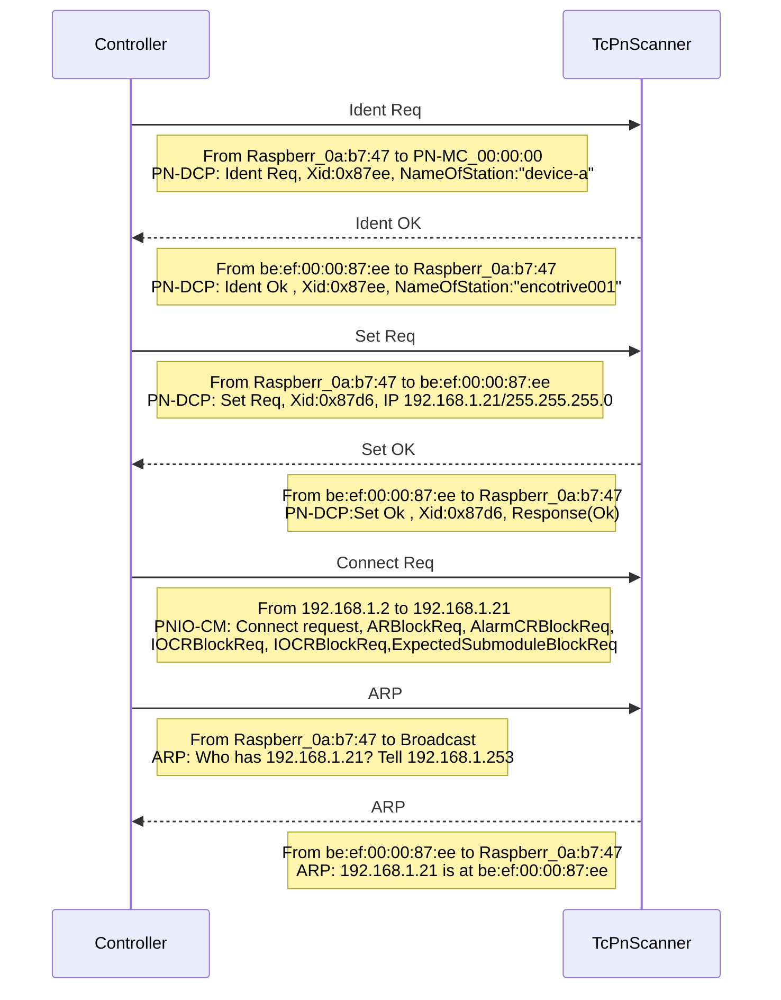

[](https://github.com/TcHaxx/TcPnScanner/actions/workflows/cicd.yml)

# TcPnScanner
Scans a Profinet controller for requested devices and adds all stations (devices) to a Profinet IO Device (TF6270).

## Why?
This is useful for virtual commissioning/digital-twin (`HiL`) projects with `Beckhoff TwinCAT`.
It's always a huge pain to gather all required `GSDML` files and to add and configure the devices manually.

## How?

It captures the connected `Profinet Controller` (Master) with `SharpPcap` and parses the received packets.
The captured information's are then transformed into a `*.xti` file, which can be imported into `TwinCAT` via the [Add Existing Item…](https://infosys.beckhoff.com/english.php?content=../content/1033/tc3_io_intro/1084406539.html) dialog.
A typical handshake between the `Controller` and `TcPnScanner` looks like this:


## Install

> TODO:
> Install via Nuget/Dotnet tool

## Usage
### Options
Option | Required | Description
--- | --- | ---
`-d`<br/>`--capture-device` | no | The name of the capture device to use.
`-t`<br/>`--timeout` | no | Capture timeout in seconds.
`-f`<br/>`--pcap-file`| no | Read from a `*.pcap` capture file.
`-o`<br/>`--out-xti-file`| no | Output directory to export the `TwinCAT` `*.xti` export file.
`-l`<br/>`--log-level`| no | Minimum LogEventLevel, i.e. `Verbose`, `Debug`, `Information`, `Warning`, `Error`, `Fatal`.
`--log-file`| no | Path to logfile, default `%TEMP%/dsian.TcPnScanner.CLI/dsian.TcPnScanner.CLI-yyyyMMddhhmm.log`
`--dump`| no | Dump captured packets to file.
`--dump-file`| no | Pcap dump file.
`-h`<br/>`--help`| no| Display help screen.
`--version`| no| Display version information.

#### Example `-h`/`--help`
```sh
dsian.TcPnScanner.CLI 0.1.0
Copyright (c) 2023 densogiaichned

ERROR(S):
  Option 'h' is unknown.

  -d, --capture-device    (Default: ) The name of the capture device to use.

  -t, --timeout           (Default: 180) Capture timeout in seconds.

  -f, --pcap-file         (Default: ) Read from a pcap capture file.

  -o, --out-xti-file      (Default: %TEMP%/$APPNAME$/$CONTROLLER$.xti) Output directory to export the TwinCAT Export file.

  -l, --log-level         (Default: Information) Minimum LogEventLevel

  --log-file              (Default: %TEMP%/$APPNAME$/$APPNAME$-.log) Path to logfile

  --dump                  (Default: false) Dump captured packets to file.

  --dump-file             (Default: %TEMP%/$APPNAME$/$APPNAME$-yyyyMMddHHmmss.pcap) Pcap dump file.

  --help                  Display this help screen.

  --version               Display version information.
```


## Credits
* [dotpcap/sharppcap](https://github.com/dotpcap/sharppcap)
* [commandlineparser/commandline](https://github.com/commandlineparser/commandline)
* [VerifyTests/Verify](https://github.com/VerifyTests/Verify)
* [Serilog](https://github.com/serilog/serilog)
